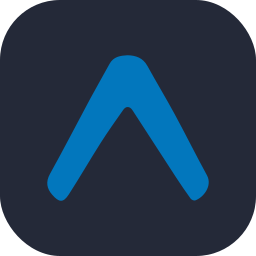
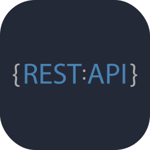
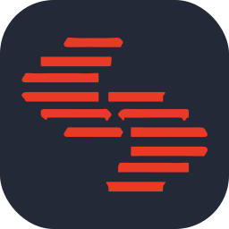
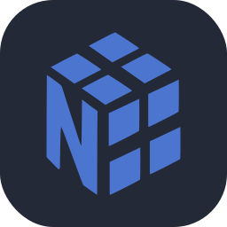
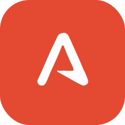
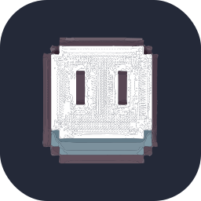
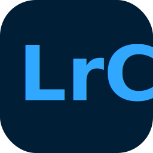

# Welcome to AristoByte Team

Welcome to our GitHub! AristoByte is a forward-thinking technology company dedicated to building innovative, scalable products for individuals and enterprises, delivering powerful tools at the intersection of performance and design.

  
  
  
  

  

  

## AristoByte - GitHub Organisation

  

## AristoByte UI - GitHub Organisation

  

## About

<ul>
  <li>
    
💼 <strong>What we do:</strong> We create high-performance, modular software solutions — from SaaS platforms to developer tooling — all under the AristoByte umbrella.

  </li>
  <li>
    
🎯 <strong>Our Focus:</strong> Engineering excellence with TypeScript, serverless architectures, and blazing-fast UIs built with React, Next.js, and modern frameworks.

  </li>
  <li>
    
🌐 <strong>Open Collaboration:</strong> We contribute to and maintain open-source projects, and welcome partnerships that push the tech world forward.

  </li>
  <li>
    
🚀 <strong>Exploration:</strong> We're actively innovating in areas like GraphQL, edge computing, real-time sync, and headless CMS integrations.

  </li>
  <li>
    
📈 <strong>Vision:</strong> We believe in continuous learning, developer empowerment, and delivering robust products that scale with your ambition.

  </li>
  <li>
    
🛠 <strong>Our Stack:</strong> Node.js, AWS, Terraform, CI/CD pipelines, observability tools, and best practices that drive reliability and speed.

  </li>
  <li>
    
🌍 <strong>User First:</strong> Every product bridges engineering precision with a frictionless user experience to create maximum impact.

  </li>
</ul>

## Featured projects

Here are some featured projects that showcase my skills in web development and my commitment to clean, maintainable code:

  
  

  
  

  

## Tech toolbox

### Recently used languages/technologies/tools:

  
  
  
  
  
  
  
  
  
  
  
  
  
  
  
  
  
  
  
  
  
  
  
  
  
  
  
  
  
  
  
  
  
  

### Know as well:

  
  
  
  
  
  
  
  
  
  
  
  
  
  
  
  
  
  
  
  
  

### UI related tools:

  
  
  
  
  
  
  
  
  

## Find us

   <!--  -->
      
      
      
      
      
      

